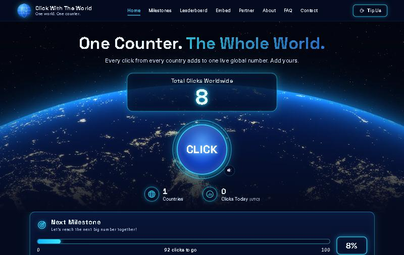

# Click With The World

**One shared counter. Every click on Earth adds to it — live.**

## Live: [www.clickwiththeworld.fun](https://www.clickwiththeworld.fun)

[](https://www.clickwiththeworld.fun)

## Features

- **Real-time global counter** — one number, shared by everyone, updating live.
- **Country leaderboard** — every click counts for the country it came from.
- **Milestone gauge** — live progress toward the next big number.
- **Embeddable widget** — put the counter on your own site; clicks there add to the same total.

## Embed this counter on your site

```html
<iframe src="https://www.clickwiththeworld.fun/embed" width="300" height="150" style="border:0;" title="Click With The World — live click counter" loading="lazy"></iframe>
```

More sizes and a script-tag version: [clickwiththeworld.fun/embed-this](https://www.clickwiththeworld.fun/embed-this)

## How it works

- **Vanilla HTML, CSS and JavaScript** — no framework, no build step.
- **Firebase Realtime Database** stores the totals and pushes every change to all open pages.
- **Increment-only security rules** — every write must be exactly +1 (see [`database.rules.json`](database.rules.json)).
- **Firebase App Check** (reCAPTCHA Enterprise) verifies clicks to keep bots out.
- **Hosted on Vercel.**

---

Built by SRT Builds · [Contact](https://www.clickwiththeworld.fun/contact)

Self-hosting guide: [docs/SETUP.md](docs/SETUP.md)
